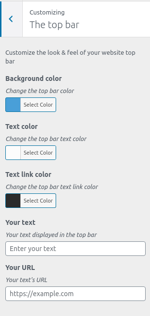

# Add a custom top bar in Storefront child theme  

**Author:** 2020 - @csocrate  
**License:** GNU General Public License v2 or later  
**License URI:** http://www.gnu.org/licenses/gpl-2.0.html  
**Version:** 1.0.0

## Description

This is a working example of Storefront child theme built to demonstrate a **customize top bar**.

### Coding from Theme Customization API

* enjoys to work with the Object Oriented Programming (OOP)
* allows us to add a new section, a customize setting and a new controller on the Theme Customization admin screen

&nbsp;

## Prerequisite

This demo is implemented as a child theme to [Storefront](https://wordpress.org/themes/storefront/), an official theme for Woocommerce, so Storefront must be installed.

## Installation

If you already have built your Storefront child theme

You can download or clone this repository and integrate the content of functions.php in your own file functions and paste the folder \inc.

If you have not yet built your Storefront child theme

You can download or clone this repository, create a folder named "storefrontchild" and paste the entire content inside.

## Resources

* [Handbook about Child Themes](https://developer.wordpress.org/themes/advanced-topics/child-themes/)
* [WordPress Codex about Theme Customization API](https://codex.wordpress.org/Theme_Customization_API)
Build custom top bar from WordPress Customize API

## More about license

**storefront-child-custom-top-bar-with-oop** is free software; you can redistribute it and/or
modify it under the terms of the GNU General Public License
as published by the Free Software Foundation; either version 2
of the License, or (at your option) any later version.

**storefront-child-custom-top-bar-with-oop** is distributed in the hope that it will be useful, but WITHOUT ANY WARRANTY; without even the implied warranty of MERCHANTABILITY or FITNESS FOR A PARTICULAR PURPOSE.  See the [GNU General Public License](https://github.com/csocrate/custom-top-bar-with-oop/LICENCE.md/) for more details.

You should have received a copy of the GNU Lesser General Public License along with this program. If not, see <https://www.gnu.org/licenses/>.

